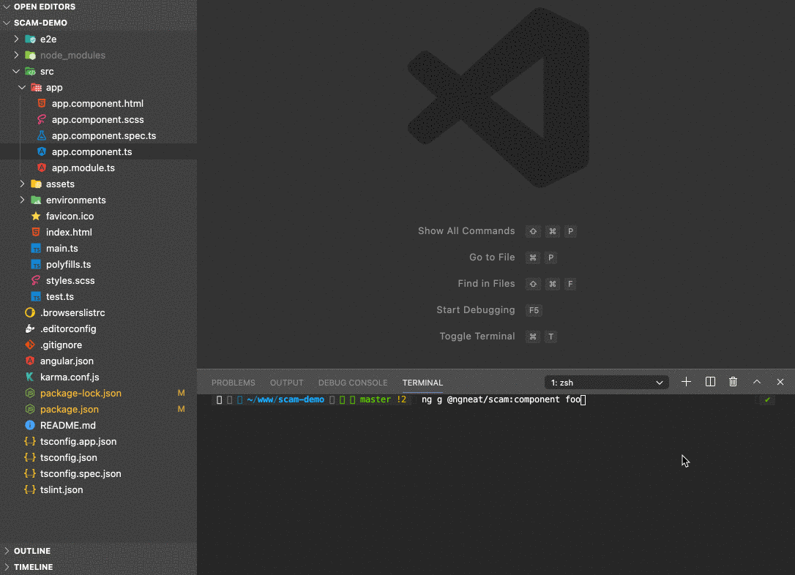
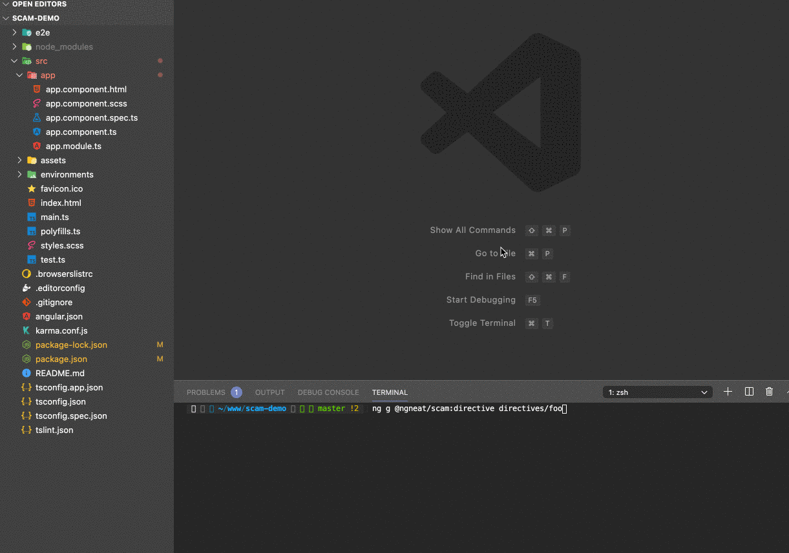

# Single (CPD) Angular Module Schematics

### Installation

```bash
npm i @ngneat/scam --save-dev
```

### Usage

### Component

```bash
ng g @ngneat/scam:component name
```



### Directive

```bash
ng g @ngneat/scam:directive name
```



### Pipe

```bash
ng g @ngneat/scam:pipe name
```


## Notes

- You can use every option from the default Angular schematics. For example:

```bash
ng g @ngneat/scam:component --name=bar --inlineStyle --inlineTemplate
```

- You can define default values for the schematics in your `angular.json` file:

```json
"schematics": {
   "@ngneat/scam:component": {
     "changeDetection": "OnPush"
   }
}
```
