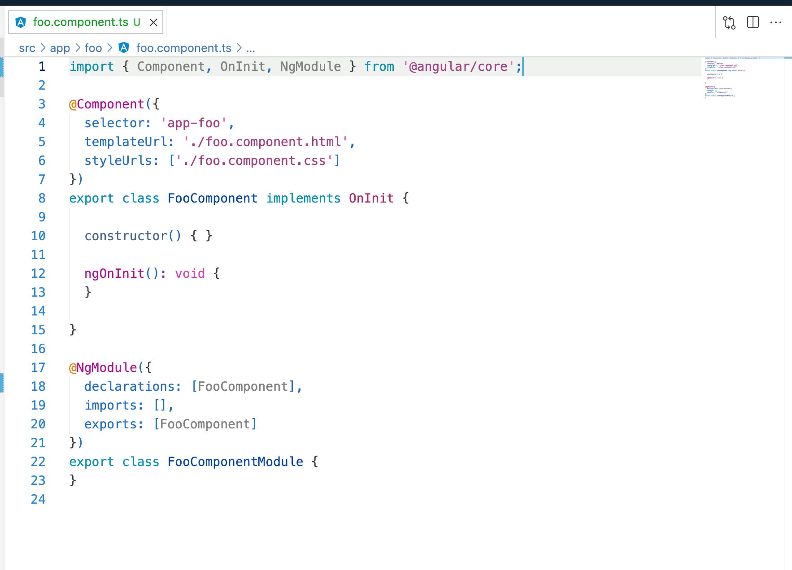
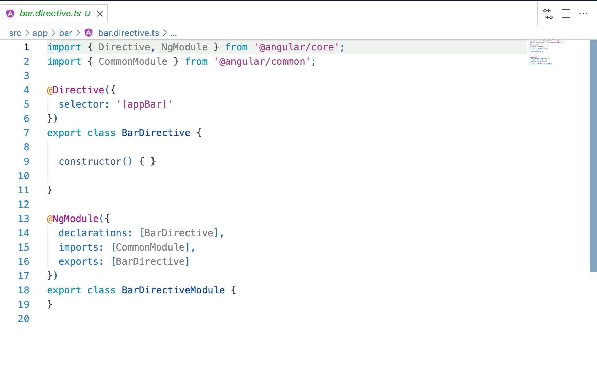
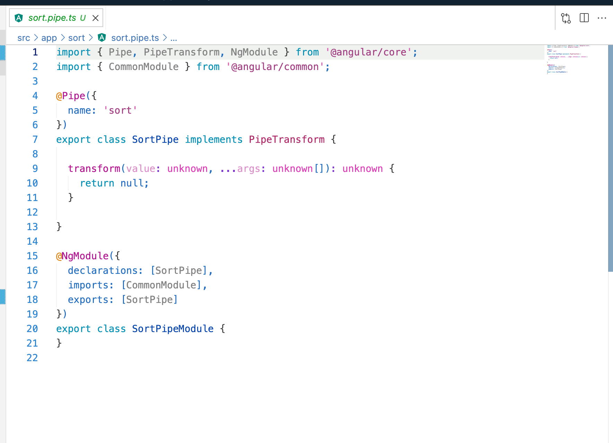

# Angular Inline Module Schematics

### Installation

```bash
npm i @ngneat/aim --save-dev
```

### Usage

### Component

```bash
ng g @ngneat/aim:component name
```



### Directive

```bash
ng g @ngneat/aim:directive name
```



### Pipe

```bash
ng g @ngneat/aim:pipe name
```



## Notes

- You can use every option from the default Angular schematics. For example:

```bash
ng g @ngneat/aim:component --name=bar --inlineStyle --inlineTemplate
```

- You can define default values for the schematics in your `angular.json` file:

```json
"schematics": {
   "@ngneat/aim:component": {
     "changeDetection": "OnPush"
   }
}
```
